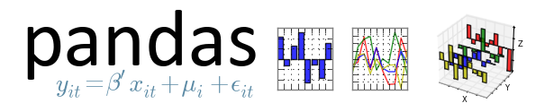

% Python: Working With Scientific Data
% Shaun Walbridge; Kevin Butler

<section data-background="images/opener_blank.png">
<h2>[https://github.com/scw/scipy-devsummit-2015-talk](https://github.com/scw/scipy-devsummit-2015-talk)</h2>
<h3>[Handout PDF](https://4326.us/scipy/devsummit-2015-scipy-arcgis-presentation-handout.pdf)</h3>
<h3>[High Quality PDF (57MB)](https://4326.us/scipy/devsummit-2015-scipy-arcgis-presentation-full.pdf)</h3>
</section>

Python {data-background="images/blank.png"}
======

Why Python? {data-background="images/blank.png"}
-----------

 - Accessible for new-comers, and the [most taught first language in US universites](http://cacm.acm.org/blogs/blog-cacm/176450-python-is-now-the-most-popular-introductory-teaching-language-at-top-us-universities/fulltext)
 - Extensive package collection (56 thousand on [PyPI](https://pypi.python.org/pypi)), broad user-base
 - Strong glue language used to bind together many environments, both open source and commercial
 - Open source with liberal license &mdash; do what you want

. . . 

- Brand new to Python? This talk may be challenging
- Resources include materials that for getting started

Release History {data-background="images/blank.png"}
---------------

 - ArcGIS 9.0 (2004, Python 2.1)
    + PythonWin COM bindings
```python
import win32com
gp = win32com.client.dispatch("esriGeoProcessing.GpDispatch.1")
```
 - ArcGIS 9.2 (2006, Python 2.4)
    + NumPy 1.0.3
    + Python-native module
```python
import arcgisscripting
gp = arcgisscripting.create()
```

Release History {data-background="images/blank.png"}
---------------
 - ArcGIS 9.3 (2008, Python 2.5.1)
    + Python GP on Server
    + `gp = arcgisscripting.create(9.3)`

 - ArcGIS 10.0 (2010, Python 2.6)
    + Fully integrated module: ``import arcpy``
    + Python window
    + New extensions:
        - arcpy.sa
        - arcpy.mapping
        - arcpy.ga

Release History {data-background="images/blank.png"}
---------------
 - ArcGIS 10.1 (2012, Python 2.7)
    + Fast cursors: ``arcpy.da.*``
    + Python Add-Ins and Python Toolboxes
    + Background Geoprocessing (64-bit)
    + matplotlib

 - ArcGIS 10.3 (2014, Python 2.7.8)
    + Python 3.4 in Pro
    + NetCDF4 
    + [Python raster function](http://desktop.arcgis.com/en/desktop/latest/manage-data/raster-and-images/python-raster-function.htm), with a [repository of examples](https://github.com/Esri/raster-functions) using SciPy for on the fly visualizations

Release History {data-background="images/blank.png"}
---------------

 - Next: 
    + SciPy stack
    + Package Management Enivonment (pip + the hard stuff)
    + Integration with R statistical language
 - Move toward maintainable, reusable code and beyond the “one-off” 

SciPy  {data-background="images/blank.png"}
=====

Why SciPy? {data-background="images/blank.png"}
----------

* Most languages don't support things useful for science, e.g.:
    + Vector primitives
    + Complex numbers
    + Statistics
* Object oriented programming isn't always the right paradigm for 
   analysis applications, but is the only way to go in many modern languages
* SciPy brings the pieces that matter for scientific problems to Python

Included SciPy {data-background="images/blank.png"}
--------------

Package                                               KLOC     Contributors      Stars
-------                                             ------   --------------    -------
[matplotlib](http://matplotlib.org/)                    63              312       2313
[Nose](http://readthedocs.org/docs/nose/en/latest/)      7               64        744
[NumPy](http://www.numpy.org/)                          84              299       1804
[Pandas](http://pandas.pydata.org)                     112              349       4115
[SciPy](http://scipy.org/scipylib/)                     91              265       1528
[SymPy](http://sympy.org/)                             223              340       1981
Totals                                                 580             1369

 {data-background="images/blank.png"}
---------------------------

  1. An array object of arbitrary homogeneous items
  2. Fast mathematical operations over arrays
  3. Linear Algebra, Fourier Transforms, Random Number Generation


[SciPy Lectures](https://scipy-lectures.github.io/intro/numpy/array_object.html#indexing-and-slicing), CC-BY

ArcGIS + NumPy {data-background="images/blank.png"}
--------------
 - ArcGIS and NumPy can interoperate on raster, table, and feature data.
 - See [Working with NumPy in ArcGIS](http://desktop.arcgis.com/en/desktop/latest/analyze/python/working-with-numpy-in-arcgis.htm)
 - In-memory data model. Example script to [process by blocks](../examples/process-by-blocks.py) if working with larger data.

ArcGIS + NumPy {data-background="images/blank.png"}
--------------


 
 {data-background="images/blank.png"}
--------------------------------

 - Plotting library and API for NumPy data


 {data-background="images/blank.png"}
---------------------------

Computational methods for:

 - Integration ([scipy.integrate](http://docs.scipy.org/doc/scipy/reference/tutorial/integrate.html))
 - Optimization ([scipy.optimize](http://docs.scipy.org/doc/scipy/reference/tutorial/optimize.html))
 - Interpolation ([scipy.interpolate](http://docs.scipy.org/doc/scipy/reference/tutorial/interpolate.html))
 - Fourier Transforms ([scipy.fftpack](http://docs.scipy.org/doc/scipy/reference/tutorial/fftpack.html))
 - Signal Processing ([scipy.signal](http://docs.scipy.org/doc/scipy/reference/tutorial/signal.html))
 - Linear Algebra ([scipy.linalg](http://docs.scipy.org/doc/scipy/reference/tutorial/linalg.html))
 - Spatial ([scipy.spatial](http://docs.scipy.org/doc/scipy/reference/tutorial/spatial.html))
 - **Statistics** ([scipy.stats](http://docs.scipy.org/doc/scipy/reference/tutorial/integrate.html))
 - **Multidimensional image processing** ([scipy.ndimage](http://docs.scipy.org/doc/scipy/reference/tutorial/ndimage.html))

<div class="notes">
Spatial is the tools across all of the domains of science, very general.

That said, can be useful in a variety of circumstances, e.g. `KDTree` for finding data quickly.
</div>


SciPy: Geometric Mean {data-background="images/blank.png"}
---------------------

 - Calculating a geometric mean of an _entire raster_ using SciPy ([source](../examples/geometric-mean.py))


```python
import scipy.stats  
rast_in = 'data/input_raster.tif'
rast_as_numpy_array = arcpy.RasterToNumPyArray(rast_in)
raster_geometric_mean = scipy.stats.stats.gmean(
    rast_as_numpy_array, axis=None)  
```

<div class="notes">
([Inspiration](https://geonet.esri.com/message/436296#436296))
</div>


 {data-background="images/blank.png"}
----------------------------
 - **Pan**el **Da**ta &mdash; like R "data frames"
 - Bring a robust data _analysis_ workflow to Python

([Source](../examples/pandas-filter.py))
```python
import pandas

data = pandas.read_csv('data/season-ratings.csv')
data.columns
```
```python
Index([u'season', u'households', u'rank', u'tv_households', \
       u'net_indep', u'primetime_pct'], dtype='object')
```

 {data-background="images/blank.png"}
----------------------------

```python
majority_simpsons = data[data.primetime_pct > 50]
```
        season households  tv_households  net_indep  primetime_pct
    0        1  13.4m[41]           92.1       51.6      80.751174
    1        2  12.2m[n2]           92.1       50.4      78.504673
    2        3  12.0m[n3]           92.1       48.4      76.582278
    3        4  12.1m[48]           93.1       46.2      72.755906
    4        5  10.5m[n4]           93.1       46.5      72.093023
    5        6   9.0m[50]           95.4       46.1      71.032357
    6        7   8.0m[51]           95.9       46.6      70.713202
    7        8   8.6m[52]           97.0       44.2      67.584098
    8        9   9.1m[53]           98.0       42.3      64.383562
    9       10   7.9m[54]           99.4       39.9      60.916031
    10      11   8.2m[55]          100.8       38.1      57.466063
    11      12  14.7m[56]          102.2       36.8      53.958944
    12      13  12.4m[57]          105.5       35.0      51.094891

 {data-background="images/blank.png"}
---------------------------

 - A Computer Algebra System (CAS), solve math equations ([source](../examples/sympy-algebra.py))

```python
from sympy import *
x = symbol('x')
eq = Eq(x**3 + 2*x**2 + 4*x + 8, 0)
```


```python
solve(eq, x)
```


Where Can I Run This? {data-background="images/blank.png"}
---------------------
 * Now: 
    - ArcGIS Pro (64-bit) "Standalone Python Install for Pro"
        + Ships most of [Scipy Stack](https://www.scipy.org/about.html) (missing IPython)
    - NumPy: ArcGIS 9.2+, matplotlib: ArcGIS 10.1+
 * Upcoming:
    - ArcGIS Desktop (32-bit), Background Geoprocessing (64-bit), Server (64-bit), Engine (32-bit)
    - IPython Included

Multidimensional Data {data-background="images/blank.png"}
=====================

NetCDF4 {data-background="images/blank.png"}
-------

 * Fast, HDF5 and NetCDF4 read+write support, OPeNDAP
 * Heirarchical data structures
 * Widely used in meterology, oceanography, climate communities
 * Easier: Multidimensional Toolbox, but can be useful

([Source](../examples/netcdf-open.py))
```python
import netCDF4
nc = netCDF4.Dataset('test.nc', 'r', format='NETCDF4')
print nc.file_format
# outputs: NETCDF4
nc.close()
```
<div class="notes">
 * CF compliant data
 * Fast, C-based access 
</div>


Multi-D Improvements {data-background="images/blank.png"}
--------------------

 - Multidimensional formats: HDF, GRIB, NetCDF
 - Access via OPeNDAP, vector renderer, Raster Function Chaining
 - [An example which combines mutli-D with time](http://desktop.arcgis.com/en/desktop/latest/manage-data/raster-and-images/creating-and-visualizing-a-multidimensional-mosaic-dataset.htm)
 - Multi-D supported as WMS, and in Mosaic datasets (10.2.1+)

Demo: Benthic Terrain Modeler {data-background="images/btm-terrain.jpg"}
=============================

Benthic Terrain Modeler {data-background="images/blank.png"}
-----------------------

 - A Python Add-in and Python toolbox for geomorphology
 - Open source, can borrow code for your own projects:
   [https://github.com/EsriOceans/btm](https://github.com/EsriOceans/btm)
 - Active community of users, primarily marine scientists, but also useful for other applications 

Lightweight SciPy Integration {data-background="images/blank.png"}
-----------------------------

 - Using `scipy.ndimage` to perform basic multiscale analysis
 - Using `scipy.stats` to compute circular statistics
 
Lightweight SciPy Integration {data-background="images/blank.png"}
-----------------------------

[Example source](../examples/calculate-bpi-with-scipy.py)
```python
import arcpy
import scipy.ndimage as nd
from matplotlib import pyplot as plt

ras = "data/input_raster.tif"
r = arcpy.RasterToNumPyArray(ras, "", 200, 200, 0)

fig = plt.figure(figsize=(10, 10))
```

Lightweight SciPy Integration {data-background="images/blank.png"}
-----------------------------

```python
for i in xrange(25):
    size = (i+1) * 3
    print "running {}".format(size)
    med = nd.median_filter(r, size)

    a = fig.add_subplot(5, 5,i+1)
    plt.imshow(med, interpolation='nearest')
    a.set_title('{}x{}'.format(size, size))
    plt.axis('off')
    plt.subplots_adjust(hspace = 0.1)
    prev = med

plt.savefig("btm-scale-compare.png", bbox_inches='tight')
```

. {data-background="images/btm-scale-compare-2.png"}
-

<br />

SciPy Statistics {data-background="images/blank.png"}
----------------


 - Break down aspect into `sin()` and `cos()` variables
 - Aspect is a circular variable &mdash; without this 0 and 360 are opposites instead of being the same value

SciPy Statistics {data-background="images/blank.png"}
----------------

Summary statistics from SciPy include circular statistics ([source](../examples/circular-stats.py)).

```python
import scipy.stats.morestats

ras = "data/aspect_raster.tif"
r = arcpy.RasterToNumPyArray(ras)

morestats.circmean(r)
morestats.circstd(r)
morestats.circvar(r)
```

Testing with Nose {data-background="images/blank.png"}
----------------------

 - [Nose](https://nose.readthedocs.org/en/latest/testing.html) &mdash; a Python framework for testing 
 - Tests improve your productivity, and create robust code
 - Nose builds on `unittest` framework, extends it to make testing easy.
 - Plugin architecture, [includes a number of plugins](https://nose.readthedocs.org/en/latest/plugins/builtin.html) and can be extended with [third-party plugins](https://nose-plugins.jottit.com/).


Testing with Nose {data-background="images/blank.png"}
-----------------
An example test from `testMain.py` ([full code](https://github.com/EsriOceans/btm/blob/master/tests/testMain.py), [example](../examples/nose-test.py)):

```python
class TestBpi(unittest.TestCase):
    def testBpiRun(self):
       input_raster = 'data/input_raster.tif'
       output_raster = 'test_run_bpi.tif'
       bpi.main(input_raster, 10, 30, output_raster)
            
       # Does our raster match the known mean?
       self.assertAlmostEqual(
           utils.raster_properties(output_raster, "MEAN"),
           0.295664335664)
```

Testing with Nose {data-background="images/blank.png"}
-----------------

Test specific BTM script:

    cd tests/
    nosetests -s testMain:TestBpi

Output:

    -----------------------------------------------------------------------------
    2 tests run in 7.1 seconds (2 tests passed)
    ----------------------------------------------------------------------
    Ran 2 tests in 4.217s

    OK

Testing with Nose {data-background="images/blank.png"}
-----------------

Supports many more options, and can integrate with tools like [`coverage`](http://nedbatchelder.com/code/coverage/) to give you information about testing coverage, or the amount of code that you've added tests for, and what lines of code are missing from your tests:

    nosetests --with-coverage

Testing with Nose {data-background="images/blank.png"}
-----------------

Coverage results:

    Name                         Stmts   Miss  Cover   Missing
    -------------------------------------------------------------------
    scripts.aspect                  24      4    83%   48-49, 53-54
    scripts.bpi                     24      4    83%   57-58, 62-63
    scripts.btm_model               39      4    90%   83-85, 89-90
    scripts.classify                90     20    78%   23, 30, 115-142
    scripts.config                   4      0   100%
    scripts.depth_statistics        39      4    90%   67-68, 72-73
    scripts.ruggedness              49      4    92%   96-97, 101-102
    scripts.slope                   18      4    78%   41-42, 46-47
    scripts.standardize_bpi_grids   28      4    86%   57-58, 62-63
    scripts.surface_to_planar      100      9    91%   179-180, 188-198
    scripts.utils                  229     38    83%   37-51, 57-86
    -------------------------------------------------------------------
    TOTAL                          644     95    85

    ------------------------------------------------------------------
    45 tests run in 316.5 seconds (45 tests passed)
    ------------------------------------------------------------------
    Ran 45 tests in 316.091s

    OK

from future import * {data-background="images/blank.png"}
====================

Opening Doors {data-background="images/blank.png"}
-------------

 - Machine learning (scikit-learn, scikit-image, ...)
 - Deep learning (theano, ...)
 - Bayesian statistics ([PyMC](https://github.com/pymc-devs/pymc3), ...)
    + Markov Chain Monte Carlo (MCMC)
 - Frequentist statistics (statsmodels)

Resources {data-background="images/blank.png"}
=========

Other Sessions {data-background="images/blank.png"}
--------------

 - Python Raster Function: Custom On-the-fly Analysis
 - Python: Working with Raster Data
 - Python: Developing Geoprocessing Tools
 - Integrating Open-source Statistical Packages with ArcGIS
 - ArcGIS Pro: Map Automation with Python

New to Python {data-background="images/blank.png"}
-------------

 - Courses:
    + [Programming for Everybody](https://www.coursera.org/course/pythonlearn)
    + [Codecademy: Python Track](http://www.codecademy.com/tracks/python)
 - Books:
    + [Learn Python the Hard Way](http://learnpythonthehardway.org/)
    + [How to Think Like a Computer Scientist](http://interactivepython.org/runestone/static/thinkcspy/toc.html)

GIS Focused {data-background="images/blank.png"}
-----------

 - [Python Scripting for ArcGIS](http://esripress.esri.com/display/index.cfm?fuseaction=display&websiteID=276&moduleID=0)
 - [ArcPy and ArcGIS - Geospatial Analysis with Python](https://www.packtpub.com/application-development/arcpy-and-arcgis-geospatial-analysis-python)
 - [Python Developers GeoNet Community](https://geonet.esri.com/community/developers/gis-developers/python)
 - [GIS Stackexchange](https://gis.stackexchange.com/)

Scientific {data-background="images/blank.png"}
----------

 Courses:

 - [Python Scientific Lecture Notes](https://scipy-lectures.github.io)
 - [High Performance Scientific Computing](https://www.coursera.org/course/scicomp)
 - [Coding the Matrix: Linear Algebra through Computer Science Applications](https://www.coursera.org/course/matrix)
 - [The Data Scientist's Toolbox](https://www.coursera.org/course/datascitoolbox)

Scientific {data-background="images/blank.png"}
----------

Books:

 - Free:
    + [Probabilistic Programming & Bayesian Methods for Hackers](https://camdavidsonpilon.github.io/Probabilistic-Programming-and-Bayesian-Methods-for-Hackers/)
        + very compelling book on Bayesian methods in Python, uses SciPy + PyMC.
    + [Kalman and Bayesian Filters in Python](https://github.com/rlabbe/Kalman-and-Bayesian-Filters-in-Python)  

Scientific {data-background="images/blank.png"}
----------
 - Paid: 
    + [Coding the Matrix](http://www.codingthematrix.com/)
        + How to use linear algebra and Python to solve amazing problems.
    + [Python for Data Analysis: Data Wrangling with Pandas, NumPy, and IPython](http://shop.oreilly.com/product/0636920023784.do)
        + The cannonical book on Pandas and analysis.

Packages {data-background="images/blank.png"}
--------

Only require SciPy Stack:

 - Scikit-learn:
    + [Lecture material](https://scipy-lectures.github.io/advanced/scikit-learn/index.html)
    + Includes SVMs, can use those for image processing among other things...
 - FilterPy, Kalman filtering and optimal estimation:
    + [FilterPy on GitHub](https://github.com/rlabbe/filterpy)
 - [An extensive list of machine learning packages](https://github.com/svaksha/pythonidae/blob/master/AI.md)

Code {data-background="images/blank.png"}
----

 - [ArcPy + SciPy on Github](https://github.com/search?p=5&q=scipy+arcpy&type=Code&utf8=%E2%9C%93)
 - [raster-functions](https://github.com/Esri/raster-functions) 
    + An open source collection of function chains to show how to do complex things using NumPy + scipy on the fly for visualization purposes
 - [statistics library](https://docs.python.org/3/library/statistics.html) with a handful of descriptive statistics included in Python 3.4.
- _TIP_: Want a codebase that runs in Python 2 and 3? [Check out future](http://python-future.org), which helps maintain a single codebase that supports both. Includes the `futurize` script to initially a project written for one version.

Scientific ArcGIS Extensions {data-background="images/blank.png"}
----------------------------

 - [Movement Ecology Tools for ArcGIS (ArcMET)](http://www.movementecology.net/)
 - [Marine Geospatial Ecology Tools (MGET)](http://mgel.env.duke.edu/mget/)
    + Combines Python, R, and MATLAB to solve a wide variety of problems
 - [SDMToolbox](http://sdmtoolbox.org/)
    + species distribution & maximum entropy models
 - [Benthic Terrain Modeler](http://www.arcgis.com/home/item.html?id=b0d0be66fd33440d97e8c83d220e7926)
 - [Geospatial Modeling Environment](http://www.spatialecology.com/gme/)
 - [CircuitScape](http://www.circuitscape.org/)

Conferences {data-background="images/blank.png"}
-----------

 - [PyCon](http://pycon.org)
    + The largest gathering of Pythonistas in the world
 - [SciPy](https://scipy.org)
    + A meeting of Scientific Python users from all walks
 - [PyVideo](http://pyvideo.org/)
    + Talks from Python conferences around the world available freely online.
    + [PyVideo GIS talks](http://pyvideo.org/search?models=videos.video&q=gis)

Closing {data-background="images/blank.png"}
=======

Thanks {data-background="images/blank.png"}
------

 - Geoprocessing Team
 - The many amazing contributors to the projects demonstrated here.
    + Get involved! All are on GitHub and happily accept contributions.

Rate This Session {data-background="images/blank.png"}
-----------------

[**www.esri.com/RateMyDevSummitSession**](https://www.esri.com/RateMyDevSummitSession)
